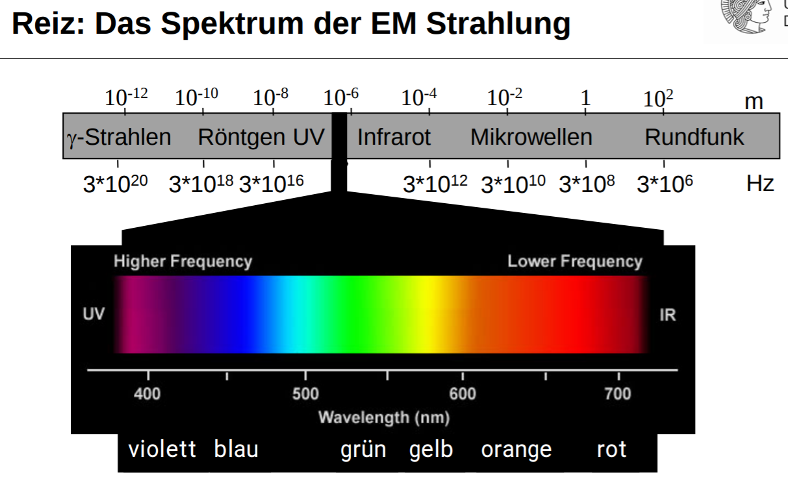
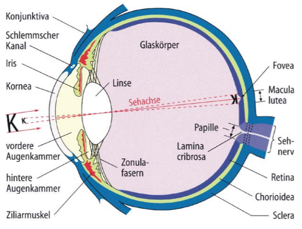

# Wahrnehmung
## Wichtiges Thema:
**HCI** - Human computer interaction

## 3-Stufen Modell der menschlichen Informationsverarbeitung
- perception (sensory) - 100 ms
- decision (cognition) - 70 ms
- response (motor) - 70 ms

## Untersysteme der Wahnehmung
- Untersysteme können (theoretisch) parallel arbeiten
- Eingabe (Wahrnehmung / Perception)
  - Visuelles Untersystem (Sehen)
  - Akustisches Untersystem (Hören)
  - Haptisches Untersystem (Fühlen)
- Ausgabe (Reaction / Action)
  - Stimmliches (Artikulations-) Untersystem (Sprechen)
  - Motorisches Untersystem (körperliche Bewegung)
  
## Von der Wahrnehmung zur Reaktion - S-R (stimulus-response) compatibility
- Schwer weil:
  - spezifische Stimuli und angewandte Reaktionen
  - wie Stimuli und Reaktionen paarweise verbinden?
  
## Wahrnehmung - Das Auge
- Reiz:
  - äußerer Reiz (Licht) erzeugt physikalische Rezeption des äußeren Reizes (im Auge)
  - produziert neuro-physiologisches Signal
  - dann mentale Verarbeitung und Interpretation des Reizes (nicht objektiv)
- technisch gesehen:
  - monochromatisches (einfarbiges) Licht beschrieben durch Parameter $\lambda$ (Wellenlänge) und $v$ (Frequenz)
  - $v \cdot \lambda = c$
  - $c \approx 3 \cdot 10^8 m/s$

## Aufbau des Auges
- Optisch abbildende Elemente
  - Kornea (Hornhaut), Kammerwasser, Linse, Glaskörper
  - Linse (Scharfeinstellung)
- Iris (Blende, 2-8mm Öffnung)
- Retina
  - Blinder Fleck (-> Sehnerv)
  - fovea centralis (Bereich größter Auflösung, gelber Fleckm macula lutea)

## Photorezeptoren
- Stäbchen
  - 100 - 120 mio
  - haupts. außerhalb Fvovea
  - Empfindlichkeitsmaximum bei 498 nm (grün)
  - Nachtsehen (skotopisch)
- Zapfen
  - 7 - 8 mio
  - vorallem in Fovea
  - 3 Typen (für Farbsehen)
  - Maxima bei 420 nm, 534 nm, 564 nm
  - Farbsehen (photopisch)
  - S Rezeptoren - Blau (10%)
  - M - Grün (48%)
  - L - Rot (42%)

## Aufbau Retina
- Horizontalzellen kombinieren mehrere Rezeptoren einer Region
- Amakrin Zellen für zeitliche Verarbeitung
- Bipolar Zellen - on/off - Licht oder kein Licht
- Ganglien Zellen
  - integrieren Informationen
  - Kontrastwahrnehmung
  - weitere Effekte

## Helligkeit
- brightness
  - wahrgenommene Menge an Licht von einer selbstleuchtenden Lichtquelle (e.g. Monitor)
- lightness
  - wahrgenommene Lichtmenge von einer reflektierenden Oberfläche
  - keine absolute Wahrnehmungsgröße (-> subjektiv)
  - abhängig von Reizstärke, Leuchtdichte zuvor-> Adaption, Leuchtdichte der Umgebung, Größe der Fläche
- Was ist weiß, was ist schwarz?
- Effekte:
  - Simultankontrast, Hermann Grid Illusion, Mach-Bänder, Chevreul Illusion
- Wahrnehmungscharakteristika (Hell - Dunkel Kontrast)
  - sehr wichtige Empfindungsgröße fürs Formensehen
  - Unterschied muss groß genug sein um wahrgenommen zu werden ( $> 0.8\%$ Weber)

## Definition Kontrast als Reiz-Verhältnis
- $m = k = \frac{L_{max} - L_{min}}{L_{max} + L_{min}}$ auch Modulationsgrad
- $K = \frac{L_R - L_H}{L_H} = \frac{\Delta L}{L_H}$
  - mit Leuchtdichte des Vordergrundreizes $L_R$
  - Leuchtdichte des Hintergrundes $L_H$

...
- Stevensches Gesetz
  - $E = c_2 \cdot R^k$ , $k = 0.3$ für Licht
  - $E = L$ für visuelle Reize
  - ($k = 2.13$ für Schmerz, $k = 0.96$ für Wärme ...)
- Kontrastempfindlichkeit
  - Definition als Funtion CSF (= contrast sensitivity function)

## Frühe Wahrnehmung
- Farbe
- Richtung
- Größe
- Beleuchtung/Schattierung
- Bewegung

## Charakteristika von Wahrnehmung
- Reiz != Wahrnemung
- Weitere Faktoren
  - Kontext
  - Individuum
  - Erwartung
  - Adaption
- Messen schwierig

## Wahrnehmung vs Realität
- Wahrnehmung entsteht durch Prozesse im Gehirn
- kein direktes Abbild der Realität
- Best-Fit Relation twischen den beiden
- menschliche Wahrnehmung adaptiert sich

## Raumwahrnehmung
- Tiefenwahrnehmung
- Distanzwahrnehmung
- Ausrichtung des Körpers im Raum
- Beteiligte Systeme
  - Vestibuläres System (im Innenohr)
  - Haptisch.somatisches System (Tasten)
  - Auditives System
  - Propriozeptives System (Eigenwahrnehmung)
  - Visuelles System

## Depth Cues
- Hinweisreize für Raumwahrnehmung
- Binokulare Depth Cues
  - Retinale Disparität / Parallaxe $|\alpha - \beta|$
  - Akkomodation (Krümmung der Augenlinsen)
  - Konvergenz (die Augen nach innen drehen)
- pictorial Depth Cues
  - Linearperspektive
  - Verdeckung
  - Texturgradient
  - Fokus und Blur
  - Atmosphärische Tiefe
  - Vertraute Größe
  - Höhe im Gesichtsfeld
  - Beleuchtung
  - Schattenwurf
  - Luminanzänderung
  - Transluzenz
  - Schattierung
- Dynamische Depth Cues
  - Bewegungsparallaxe
  - Kinetischer Tiefeneffekt
  - Interposition
  - Bewegung von Highlights

## Limitierung unserer Wahrnehmung
- Reiz != Wahrnehumg
  - Limitierung bei der initialen Reizaufnahme (Auge)
  - nur Bruchteil des Reizes kommt zur kognitiven Verarbeitung
  - Aufmerksamkeit, externe Faktoren, ...
- Wahrnehmung ist partielle Hypothese aufgrund unvollständiger Information
  - mentales Bild ist konstruiertes Modell
  - Hypothese wird gegen sensorische Daten getestet
  - dynamische Suche des visuellen Systems nach der besten Hypothese

## Aufmerksamkeit "Gateway to Memory"
- Filter im Gehirn
- Gewählt (selektiv)
  - Augen folgen Objekten von Interesse
  - Kopf folgt Klängen von  Interesse
  - Ein einziger Ort der Aufmerksamkeit
- Geteilt (divided)
  - entweder gleichzeitig oder durch schnelle Umschaltung (time multiplexed)
  - wirkt sich negativ auf Verarbeitung aus, wenn die Aufgaben überfordern
  - Aufgaben beeiträchtigen sich gegenseitig
- Erfasst (captured)
  - ein äußerer Reiz zierht alle Aufmerksamketi auf sich

## Memory
- Arbeitsgedächtnis
  - schneller Zugriff 70 ms
  - schneller Verfall 200 ms (wird nach wenigen Sekunden ins Langzeitgedächtnis weitergegeben)
  - eingeschränkte Kapazität
- Informationen in Stücke / chunks zerlegen
- "flush" sobald Aufgabe beendet ist oder im Langzeitgedächtnis 
- Langzeitgedächtnis
  - langsamer 100 ms
  - sozusagen unbegrenzt groß
  - Zugriff ist kompliziertes Verfahren
  - Informationen Speichern, Erinnerung
  - Informationen abrufen
  - Vergessen

