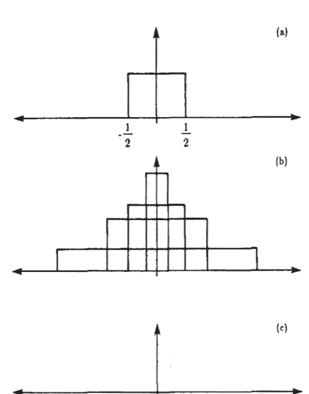
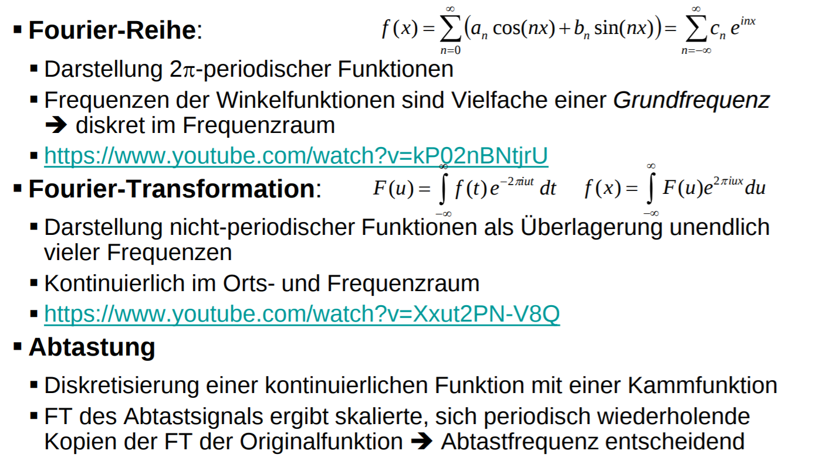

# Fourier
## Mathe refreseher
- Polarkoordinaten $P(r \;|\; \varphi)$
- $x(r, \varphi) = r \cdot cos(\varphi)$
- $y(r, \varphi) = r \cdot sin(\varphi)$
- $z = |z| \cdot e^{i\varphi}$
- $e^{i\varphi} = cos(\varphi) + i \; sin(\varphi)$

## Dirichlet Bedingungen
- Die Anzahl der Unstetigkeiten innerhalb einer Periode ist endlich
- Die Anzahl der Maxima und Minima innerhalb einer Periode ist endlich
- Die Funktion ist in jeder Periode integrierbar

=> Die Funktion lässt sich als Summe von Kosinus und Sinusfunktionen darstellen

## Fourier Reihe
- Sei $f(x)$ eine $2\pi$ periodische Funtion, welche die Dirichlet Bedingungen erfüllt
- $f(x) = \sum_{n = 0}^{\infty}(a_n \; cos(nx) + b_n \; sin(nx))$
- $a_n$ und $b_n$ heißen Fourier Koeffizienten

## Berechnung der Koeffizienten
- $a_0 = \frac{1}{2\pi}\int_{-\pi}^{\pi}f(x)dx$
- $a_m = \frac{1}{\pi}\int_{-\pi}^{\pi}f(x)cos(mx)dx$ mit $m>0$
- $b_m = \frac{1}{\pi}\int_{-\pi}^{\pi}f(x)sin(mx)dx$
- für gerade Funtionen sind alle $b_n = 0$
- für ungerade Funtionen sind alle $a_n = 0$

## Fouriertransformation
- $f(x) \rightarrow F(u)$
- $F(u) = \int_{-\infty}^{\infty}f(x)e^{-i2\pi ux}dx$
- $F(u) \rightarrow f(x)$
- $f(x) = \int_{-\infty}^{\infty}F(u)e^{i2\pi ux}du$
- oft ist $f(x)$ reell und $F(u)$ komplex
- Zerlegung einer Funtion (eines Signals) in dessen Frequenzbestandteile

## Faltung und Filterung
- faltung = convolution (sliding window)
- Faltungsintegral einer Convlolution
  - $h(t) = \int_{-\infty}^{\infty}f(x)g(t-x)dx := f(t) \circ g(t)$
- Fouriertransformierten $H$, $F$ und $G$
  - $H(\xi) = F(\xi) \cdot G(\xi)$
- Einer Faltung im Ortsraum entspricht eine Multiplikation imm Frequenzraum

## Abtastung von Signalen
- Wie kontinuierliche Funtionen abtasten um diskrete Funktionen zu erhalten?
- Dirac-Delta-Distribution
  - $\int_{-\infty}^{\infty}\delta(x)dx = 1$
  - $\delta(x) = n \cdot rect(nx)$
    - $rect(x) = 1$ für $|x| < \frac{1}{2}$
    - $rect(x) = 0$ sonst 

- Diskrete Abtastung
  - $\hat{f}(x) = f(x) \cdot \sum_{n=-\infty}^{\infty}\delta(x-n\Delta x)$
- Fouriertransformierte $\hat{F}(u)$ entspricht $F(u)$ der nicht-abgetasteten Funtion $f(t)$, die aber periodisch mit der Periode $frac{1}{\Delta x}$ wiederholt und mit $\frac{1}{\Delta x}$ sklaiert wurde

## Abtasttheorie
- Sei $f(x)$ bandbegrenzt durch $u_G$ d.h. $F(u) = 0$ für $|u| > u_G$
- Dann gilt für $2u_G < \frac{1}{\Delta x}$:
  - Die Kopien der Fouriertransformierten $F(u)$ überlappen sich nicht
  - Die Spektren $F(u)$ und $\hat{F}(u)$ stimmen auf dem Intervall $[-u_G, u_G]$ bis auf den Skalierungsfaktor $\frac{1}{\Delta x}$ überein
  - Das Frequenzspektrum von $F(u)$ kann vollständig aus dem Abtastsignal und damit den Abtastwerten berechnet werden
  - **gut**
- für $2u_G > \frac{1}{\Delta x}$:
  - Die Kopien der Fouriertransformierten $F(u)$ überlappen sihc
  - In den Überschneidungsbereichen bilden sich Summen
  - Es ist unmöglich, $F(u)$ aus den Abtastwerten wiederzugewinnen
  - **Aliasing**
  - **böse**

## Zusammenfassung
