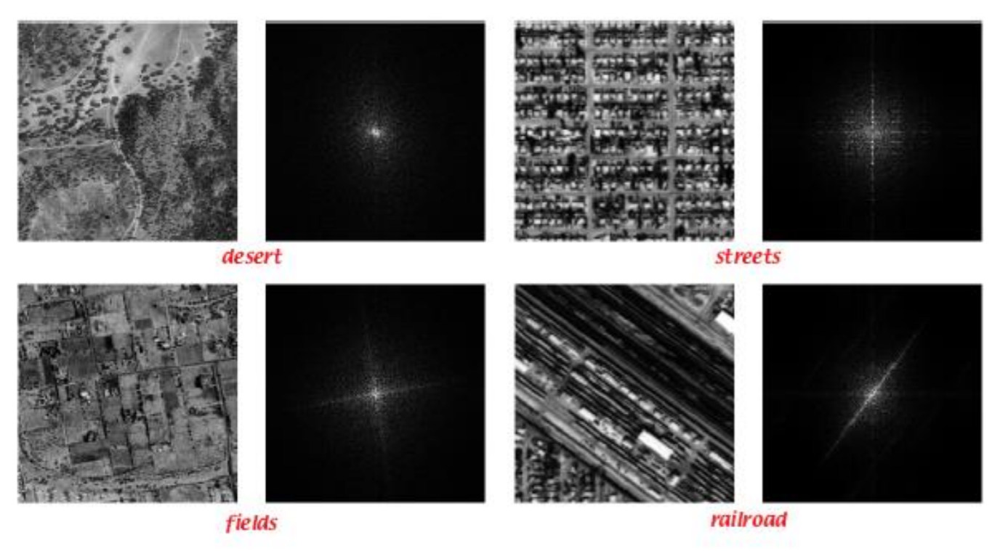

# Bilder

## Bildverbesserung - Methoden
- Ortsraum
  - Direkte Manipulation der Pixelwerte im Bildbereich
    - Pixeloperationen
      - Grauwertabbildungen der Pixel *unabhängig* von deren Nachbarschaft
    - Filteroperationen
- Frequenzraum
  - Bildtransfromation
    - DFT Discrete Fourier Transform
    - DCT Discrete Cosine Transform
  - Manipulation der Transformierten
  - Rücktransformation in Bildbereich

## Bildverbesserung - Anwendungen
- Korrektur von nicht-Linearitäten der Kamera
- Anpassung Helligkeit, Kontrast
- Bildbereiche hervorheben, unterdrücken
- Bild ausgleichen

## Histogramm
- Graphische Darstellung der Häufigkeitsverteilung der Farb/Grauwerte
  
## Kontexte
- Bilddynamik
  - Bereich reeller Lichtintensitäten, der auf die Grauwertskala abgebildet wird
- Bildkontrast
  - Bereich der Grauwertskala, der zur Darstellung der Bildinformation ausgenutzt wird
- Bildhelligkeit
  - Beläuchtungsstärke (Grauwert)
- Zusammenhang
  - Bildhelligkeit = Mittelwert aller Grauwerte
  - Bildkontrast = Varianz aller Grauwerte
- Alles sichtbar aus Histogramm

## Pixeloperationen
- Negativ
  - $g(m, n) = f_{max} - f(m, n)$
- Binärisierung/Thresholding
  - $g(m, n) = f_{max}$ für $f(m, n) > \tau$
  - $g(m, n) = f_{min}$ für $f(m, n) \leq \tau$
  - Spezialfall Binärisierung $f_{max} = 1$ und $f_{min} = 0$
- (Grauwert) Fensterung
  - Hervorheben eines bestimmten Intensitätsintervals im Bild
  - z.B. bei Ultraschall
- Kontrastspreizung
  - Abbildug der Grauwerte auf eine neue Grauwertskala mit einer einwertigen, monotonen Funktion
- Dynamikkompression
- Gammakorrektur (Bildschirm)
- Helligkeit
- Histogrammausgleich
  - Transformieren der Grauwertskala anhand der Kurve der Summenwahrscheinlichkeit
    - $p(g) = max(\text{Intensität}) \cdot \sum_{i=0}^g p(i)$
    - Verlustbehaftet, nicht Umkehrbar
- Differenz
- Mittelung
  - Unterdrückung von unkorreliertem Rauschen durch Mittelung über $k$ Aufnahmen
    - $g(m, n) = \frac{1}{k} \sum_{i=0}^{k-1}f_i(m, n)$

## Bildfilterung
- Im Ortsraum
  - Filtermasken (lineare Faltung, Convolution)
    - Mittelwertfilter (Boxfilter)
    - Gaussian
      - $G(x, y) = \frac{1}{2\pi \sigma^2}e^{-\frac{x^2 + y^2}{2\sigma^2}}$
      - Normalisieren nicht vergessen
    - 1. Ableitung $g(i) = f(i) - f(i-1)$
    - 2. Ableitung
      - Laplacian
      - Laplacian of Gaussian (LoG)
- Im Frequenzraum
  - Erinnerung: $f \circ h = F^{-1}(F(f)\cdot F(h))$
  - $F(u, v)$
  - = Pixelwert im Frequenzraum
  - = Amplitude der periodischen Funktion, die die Frequenzen $u$ in x-Richtung und $v$ in y-Richtung besitzt

- Filterarten Frequenzraum
  - Hochpaß
    - $H(\omega) = 0$ für $|\omega| < \omega_1$
    - $H(\omega) = 1$ für $|\omega| \geq \omega_1$
    - Abschneiden der tiefen Frequenzen $|\omega| < \omega_1$. Es können nur hohe Frequenzen passieren. 
    - Scharfe Übergänge werden deutlicher
  - Tiefpaß
    - $H(\omega) = 1$ für $|\omega| < \omega_1$
    - $H(\omega) = 0$ für $|\omega| \geq \omega_1$
    - Abschneiden der hohen Frequenzen $|\omega| > \omega_1$. Es können nur tiefe Frequenzen passieren. 
    - Rauschen wird eliminiert. Bild generell etwas unschärfer (blur)
  - Bandpaß Filert
    - $H(\omega) = 0$ für $|\omega| \leq \omega_1$
    - $H(\omega) = 1$ für $\omega_1 < |\omega| < \omega_2$
    - $H(\omega) = 0$ für $|\omega| \geq \omega_2$
    - Nur Frequenzen aus dem Band können passieren