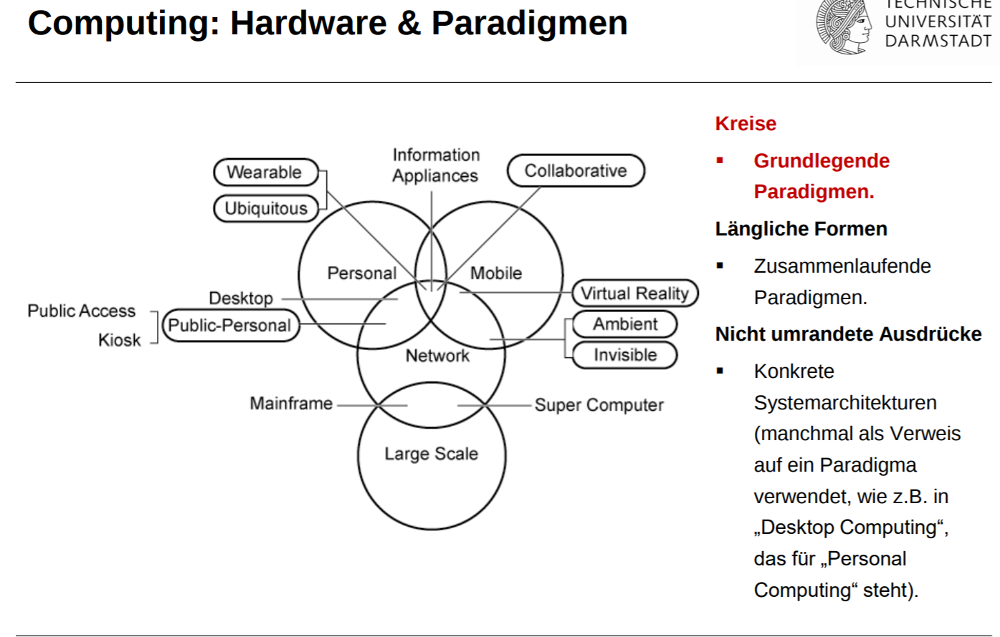
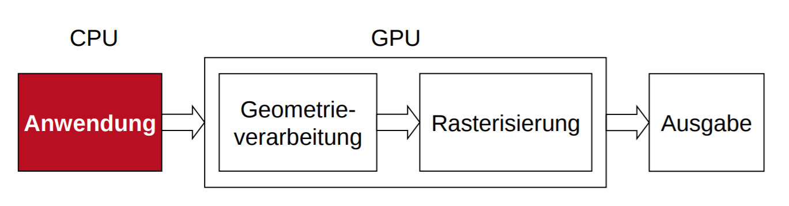

# Grafikpipeline

## Hardware


- Paradigmen
  - P1 Large-Scale Computing
    - Host und Terminal Systeme, Rechenzentren
  - P2 Personal Computiong Desktop Computing
  - P3 Network Computing
    - WAN
    - MAN
    - LAN
    - PAN
    - Wired - Wireless
  - P4 Mobile Computing
    - Laptops
    - Tablets 
    - Smartphone
    - ...
- Zusammenlaufende Paradigmen+#
  - ZP1 Collaborative Computiong
    - z.B. Multitouchtables
  - ZP2 Virtual Reality
    - Nicht-immersive Umgebungen
      - Bildschirm und zeigerbasiert
      - 3D-Anzeige, eventuell haptisches Feedback
    - Immersive Umgebungen
      - Es wird Eindruck erweckt, tatsächlich in einer Welt aus virtuellen Objekten zu sein
    - IO:
      - HMD Head Mounted Display
      - SID Spacial Immersive Display
      - CAVE Cave automated virtual environment
      - Head-Movement Tracking Systeme
    - Augmented Reality
      - nahtlose Integration zwischen realen und virtuellen Objekten
  - ZP3 Ambient / invisible
    - lebenserleichternde Lösungen
    - assisted Living
    - zb berührungslose Freiraum-Gestenerkennung (Kinect)
  - ZP4 Wearable / Ubiquitous
    - Smartwatch...

## Computergrafik
- 3D Objekte in der Realität
- Modellierung zu 3D Modellen
  - Szene
  - Geometrie
  - Material
  - Beleuchtung
  - Rasteriesierung
- Darstellung als Bilder
  - Interaktion
  - Animation

## Grafikpipeline
 
- Anwendung
  - Eingabe grafischer Daten
  - Generierung von 3D-Modellen
  - Repräsentation von 3D Daten
    - Grafische Primitive
      - Punkte
      - Linien
      - Dreiecke
    - Transformationen
      - Translation
      - Rotation
      - Skalierung
      - Scherung
    - Räumliche Datenstrukturen
      - Hüllkörperhierarchie
        - Körper um Objekte herum
        - Schnittests mit anderen primitiven müssen einfach möglich sein
        - "Hitbox" ?
      - Raumunterteilung
        - Achsenparallele Gitter (Grids)
        - einfach
        - Objekt in mehreren Zellen enthalten
        - kann sich der Geometrie nicht anpassen
        - sehr Speicheraufwendig
        - effizient traversierbar
        - schneller Zugriff auf Nachbarn möglich
        - Voxel / Volumendarstellung
        - Quadtrees
        - Binary Space Partition (BSP Tree)
          - an durch polygonen induzierten Ebenen Teilen
- Geometrieverarbeitung
  - Modell Transformation
    - Kanonische Position und Orientierung
    - Sichtvolumen und Auge nach Koordinaten System ausgerichtet
    - Parallelprojektion:
      - Sichtvolumen gleich Einheitswürfel
    - Perspektive
      - Sichtvolumen = Pyramide
    - Ziel: einheitliches Sichtvolumen für die nachfolgenden Algorithmen
  - Simulation der Beleuchtung in den Knoten
    - Beleuchtung des Primitivs
      - Flat Shading
      - Gouraud Shading
      - Phong Shading
  - Perspektivische Transformation und Clipping
    - Sichtbarkeit
    - Sichtbar ist der dem Auge am nächsten liegende Punkt
    - Ist das Objekt durchsichtig, wird der dahinterliegende Punkt auch sichtbar (usw.)
    - Clipping
      - Abschneiden von Objekten am Rand eines gewünschten Bildschirmausschnittes
    - Painters Algorithmus
      - Zeichne Polygone wie ein Maler
      - Tiefe $z \in [z_{min}, z_{max}]$
      - Das am weitesten entfernte zuerst (nach $z_{max}$)
      - Algo:
        - Sortiere Polygone nach $z$-Wert
        - Falls $z$-Intervalle überlappen, Schnittpolygone berechnen und einsortieren
        - Beginne das Zeichnen mit dem Polygon mit größtem $z$-Wert
        - $O(n^2)$ ($n$ ist Anzahl Polygone)
  - Culling
    - Rückseiten erkennen
      - Skalarprodukt aus Sehstrahl und Normal positiv
      - $n \cdot s > 0$
    - alle Rückseiten von weiterer Betrachtung ausschließen
  - Projektion
- Rasterisierung der Primitive nacheinander
  - Scan-Convertierung
    - Primitive (Linien, PÜolygone) in Pixel zerlegen
    - Rasteralgorithmen
      - von Bresenham für Linien
      - Scanline Algorithmus für Polygone
  - Verdeckungsrechnung
    - z-Buffer Algorithmus
- Ausgabe
  - Speichern
  - Display
  - Hardcopy


## Algorithmus von Bresehnham
- geg: Zwei Punkte (Start und Ende der Linie)
- Ziel: Rasterisierung der Linie
```python
dx = xend - xstart
dy = yend - ystart
x = xstart
y = ystart
SETPIXEL(x, y)
fehler = dx / 2
while x < xend:
    x = x + 1
    fehler = fehler - dy
    if fehler < 0:
        y = y+1
        fehler = fehler + dx
    SETPIXEL(x, y)
```

## z-Buffer Algorithmus
- Für jeden Bildpunkt einen z-Wert speichern (Tiefenbild)
- Initialisierung
  - Bildspeicher auf Hintergrundfarbe
  - z-Speicher auf maximalen z-Wert
- Alle Objekte der Szene nacheinander rastern
  - keine besondere Reihenfolge erforderlich
- Algo:
  - Für jeden Punkt (x, y) eines darzustellenden Polygons
    - Berechne z(x, y)
      - Perspektivische Projektion erlaubt keine lineare Interpolation mehr
    - Ist z(x, y) kleiner als der bereits unter (x, y) gespeicherte Wert:
      - schreibe z(x, y) in den z-Speicher und den zugehörigen Farbwert an der Stelle (x, y) in den Bildspeicher
- Vorteile
  - Jede Szene mit jeglicher Art von Objekten kann behandelt werden
  - Komplexität unabhängig von Tiefenkomplexität
  - In fertige Szene können nachträglich Objekte eingefügt werden
  - Spezielle Objekte, wie 3-D Cursor können mit korrekter Verdeckung dargestellt werden
  - Leich in Hardware realisierbar
- Nachteile:
  - Pro Bildpunkt wird nur ein Objekt gespeicher
  - Transparenz prinizipiell nicht realisierbar
  - Genauigkeit des z-Buffers beschränkt
    - getrennte Objekte erhalten selben z-Wert
    - Farbe wird dann von Objektreihenfolge in Rasterung bestimmt


