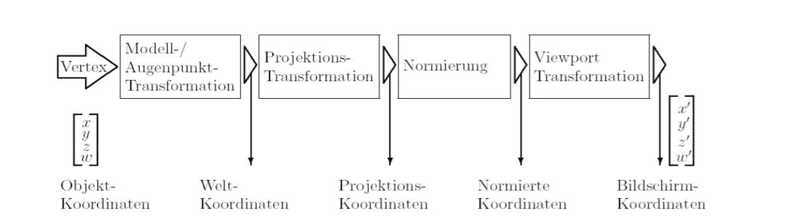

# Transformationen
- Teil der Anwendung in der Grafikpipeline

## Koordinaten aus Sicht der Grafikpipeline
- Objektkoordinaten
  - legen Lage von 3D Objekten lokal fest
- Weltkoordinaten
  - beschreiben die gesamet Szene in 3D
- Projektionskoordinaten
  - erhält man nach Anwendung paralleler oder perspektivischer Projektionskoordination
- Normierte Koordinaten
- Bildschirmkoordinaten
  - stellen Szene in Fenster einer gewählten Größe und Position dar

## Transformationen in der Grafikpipeline
- Modelling Transformations
  - ordne 3D Objekte (Modelle) im Raum an und positioniere diese
- Viewing Transformations
  - wähle Betrachterstandpunkt und positioniere diesen (Default: Ursprung & Blickrichtung ist negative z-Achse)
- Projection Transformations
  - projiziere Viewing Volume (sichtbarer Ausschnitt der Szene) in 2D
- Viewport Transformations
  - wandle in Bidschirmloordinaten um

## Affine Transformation / Abbildung
- Arten
  - Translation
  - Rotation
  - Skalierung
  - Scherung
- Affine Abbildung
  - Eigenschaften
    - Bilder Geraden auf Geraden ab
    - beschränkte Objekte bleiben beschränkt
    - Verhältnisse von Längen, Flächen, Volumen bleiben erhalten
    - Parallele Objekte (Geraden, Ebenen, ...) bleiben parallel
  - als lineare Abbildungen
    - $\phi: \mathbb{R}^n \rightarrow \mathbb{R}^n$ heißt affine Abbildung, wenn sie als $\phi(v) = A(v) + I(b)$ darstellbar ist mit
      - $A$ lineare Abbildung, $I$ identität und $v, b \in \mathbb{R}^n$
      - $A$ heißt linear, wenn $A(\lambda u + \mu v) = \lambda A(u) + \mu A(v)$
  - Affine Abbildung setzen sich also aus linearem Teil $A$ und einer Translation $b$ zusammen

## Homogene Koordinaten
- n-dimensionale homogene Koordinaten werden zu n+1 dimensionalen homogenen Koordinaten
- $\begin{pmatrix}x \\ y\\ z\end{pmatrix} \rightarrow \begin{pmatrix}x \\ y\\ z \\ 1\end{pmatrix} = \begin{pmatrix}sx \\ sy\\ sz \\ s\end{pmatrix}$ mit Skalierungsfaktor $s$
- $\begin{pmatrix}x \\ y\\ z \\ w\end{pmatrix} = \begin{pmatrix}x/w \\ y/w \\ z/w \end{pmatrix}$

## Matrizenschreibweise Affine Abbildung
- Jede 3D affine Abbildung lässt sich durch eine 4x4 Matrix ausdrücken
$\begin{pmatrix}x' \\ y' \\ z' \\ 1\end{pmatrix} = \begin{pmatrix}a_{11} & a_{12} & a_{13} & x_{0} \\ a_{11} & a_{22} & a_{23} & y_{0} \\ a_{31} & a_{32} & a_{33} & z_{0} \\ 0 & 0 & 0 & 1\end{pmatrix} \cdot \begin{pmatrix} x \\ y \\ z \\ 1 \end{pmatrix}$

## Skalierung, Scherung, Rotation
- Skalierung
  - $A = \begin{pmatrix} s_1 & 0 & 0 \\ 0 & s_2 & 0 \\ 0 & 0 & s_3 \end{pmatrix}$
  - Vorsicht, $s_1, s_2, s_3$ können unterschiedlich sein!
- Scherung
  - $A = \begin{pmatrix} 1 & s_2 & s_5 \\ s_1 & 1 & s_6 \\ s_3 & s_4 & 1 \end{pmatrix}$
- Rotation um $\alpha$ um die
  - $z$-Achse
    - $A = \begin{pmatrix} cos(\alpha) & -sin(\alpha) & 0 \\ sin(\alpha) & cos(\alpha) & 0 \\ 0 & 0 & 1 \end{pmatrix}$
  - $x$-Achse
    - $A = \begin{pmatrix}1 & 0 & 0 \\ 0 & cos(\alpha) & -sin(\alpha) \\ 0 & sin(\alpha) & cos(\alpha) \end{pmatrix}$
  - $y$-Achse
    - $A = \begin{pmatrix} cos(\alpha) & 0 & sin(\alpha) \\ 0 & 1 & 0\\ -sin(\alpha) & 0 & cos(\alpha) \end{pmatrix}$
- Rotation um $\alpha$ um beliebige Achse $r$
  - Orthonomale Basis $r, s, t$ bestimmen
    - erster Basisvektor ist $r$
    - $s = \frac{r \times e_x}{\parallel r \times e_x \parallel}$ oder $s = \frac{r \times e_y}{\parallel r \times e_y \parallel}$
    - $t = r \times x$
  - Basisvektoren in die **Zeilen** von $R$ schreiben
  - $R_r = R^{-1} R_{\alpha}^x R$
- Rotation um beliebige Raumachse
  - 1. Verschiebung des Rotationszentrums in den Ursprung
  - 2. Rotation
  - 3. Zurückverschiebung in das Rotationszentrum

## Anmerkungen zu Transformationen
- Achtung: Transformationen sind im Allgemeinen nicht kommutativ
- Bei Kette von Transformationen $A_1, A_2, ..., A_n$ ist es günstiger, einmalig das Produkt
- $A = A_n \cdot ... \cdot A_2 \cdot A_1$ zu berechnen

## Projektion
- Projektive Abbildungen
  - Geraden werden auf Geraden abgebildet
  - Schnitte von Geraden bleiben erhalten
  - Flächen werden auf Flächen abgebildet
  - Reihenfolge von Punkten auf projektiven Geraden bleiben erhalten
  - **Winkel verändern sich**
    - Parallelität geht oft verloren
    - Parallelen schneiden sich in Fluchtpunkten
    - Rechtecke werden auf Vierecke transformiert
  - sind also **keine affinen Abbildungen**
  - $y_0 = y \cdot \frac{x_0}{x_0 + x}
  - $\begin{pmatrix} x \\y \end{pmatrix} \mapsto \begin{pmatrix} 0 \\ \frac{y \cdot x_0}{x_0 + x} \end{pmatrix}$
  - Es entsteht eine homogene 3x3 Matrix (**2D Geometrie"**) der perspektivischen Projektion, die sich in Parallelprojektion und perspektivische Transformation zerlegen lässt
  - $\frac{1}{x_0} \cdot \begin{pmatrix} x' \\y' \\ 1 \end{pmatrix} = \begin{pmatrix} 0 & 0 & 0 \\ 0 & 1 & 0 \\ \frac{1}{x_0} & 0 & 1 \end{pmatrix} \cdot \begin{pmatrix} x \\y \\1 \end{pmatrix}$
  - und der Zerlegung $\begin{pmatrix} 0 & 0 & 0 \\ 0 & 1 & 0 \\ \frac{1}{x_0} & 0 & 1 \end{pmatrix} = \begin{pmatrix} 0 & 0 & 0 \\ 0 & 1 & 0 \\ 0 & 0 & 1 \end{pmatrix} \cdot \begin{pmatrix} 1 & 0 & 0 \\ 0 & 1 & 0 \\ \frac{1}{x_0} & 0 & 1 \end{pmatrix}$ perspektivische Projektion = Parallelprojektion $\cdot$ perspektivische Transformation
  - Ein, Zwei und Dreipunktperspektive
- perspektivische Projektion
  - Projektionsstrahlen treffen sich im Augpunkt
  - entspricht natürlicher Wahrnehmung des Menschen
  - Abstand zwischen Objekten und Projektionsebene geht ein
  - Längenverhältnisse ändern sich
  - Winkel ändern sich
  - parallele Geradden bleiben nicht parallel
- parallele Projektion
  - weniger "Realismus
  - Winkel ändern sich nicht
  - parallele Geraden bleiben parallel
  - z.B. in Medizin bevorzugt

## 3D Interaktion mit 2D Eingabegeräten
- Ansätze
  - Desktop
  - Multi-Window (Mehrfachauswahl)
  - Direktes 2D Maus-Mapping
  - Manipulatoren
- Manipulatoren
  - Häufig in 2D verwendet
    - Kästen in Grafikprogrammen, mit denen skaliert, rotiert oder verschoben werden kann
    - Drag and Drop Operationen
    - einfach zu implementieren
      - 1:1 Abbildung zwischen Mauszeigerposition und "Knauf" im 2D Raum
      - Schnitttests leicht zu implementieren
      - Interpretation der Bewegung einfach
      - keine Probleme der perspektivischen Abbildung
  - immer häufiger auch in 3D
    - Manipulatoren für Transformationen
    - Navigation der Kamera
    - schwerer zu implementieren
      - virtuelle 3D Szene wird in 2D angezeigt
      - Mehrdeutigkeiten - unendlich viele Möglichkeiten die Cursorposition auf eine gerade in 3D abzubilden
      - noch schwerer, wenn 2D Cursor bewegt wird

