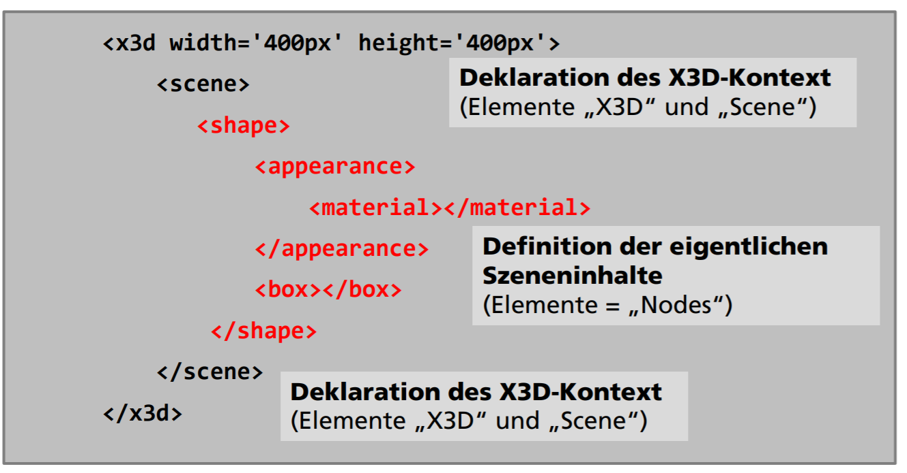

# Szenengraphen am Beispiel von X3DOM
- Herausforderungen:
  - Effizienz
  - Portabilität
  - nahtlose Integration von 3D-Grafik in bestehende Anwendungen
  - Vereinfachung und Vereinheitlichung der Entwicklungsarbeit
  
## Szenengraphen
- strukturieren Komplexe Beziehungen zwischen Daten einer Szene
  - Objektgeometrie
  - Transformationen
  - Materialien
  - Kameras
  - Lichter
  - Spezialeffekte
  - Transformationshierarchien, Gruppierungen und Instanzierung von Objekten
- Directed Acyclic Graph (DAG) Knotentypen und:
  - Gruppierung
  - Transformation
  - Objektdaten
- Vorteile:
  - Wiederverwendbarkeit der Objektdaten
  - Semantische Gruppierungen der Objektdaten
  - Transformationshierarchie ermöglicht Transformationen von kompletten Gruppen ohne explizit ändern zu müssen

## X3DOM
- deklarative Szenengraph API audf Basis von X3D im DOM
  - Deklarativ:
    - Szenengraph durch strukturiertes Textformat (XML) beschrieben
  - X3D:
    - Szenengraph Standard
    - XML basiert
    - benötifgt traditionell X3D Player
  - DOM
    - HTML Document Object Model
    - dokumentiert Baumstruktur und API in HTML/Javascript

  - Shape
    - definiert zeichenbares Objekt
    - = Appearance + Geometry
  - Appearance
    - enthält infos über Materialfarbe, Texturen, ...
  - Material
    - definiert Materialeigenschaften gem. Phong Modell
  - Box
    - spezieller Geometry Knoten
    - definiert Geometrie einer einfachen Box

Problem mit X3DOM (mittels HTML):
- HTML Elemente sind Bäume, haben also **nur einen Elternknoten**
- Lösung: X3D definiert DEF/USE Mechanismus