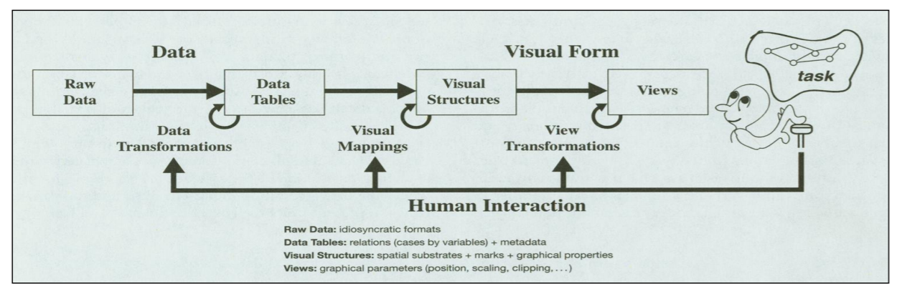
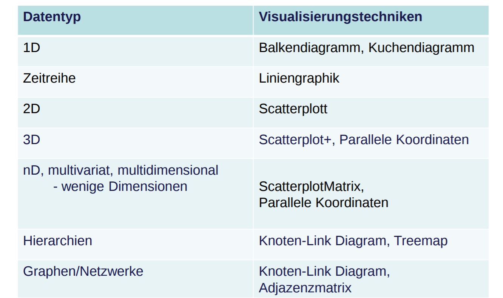
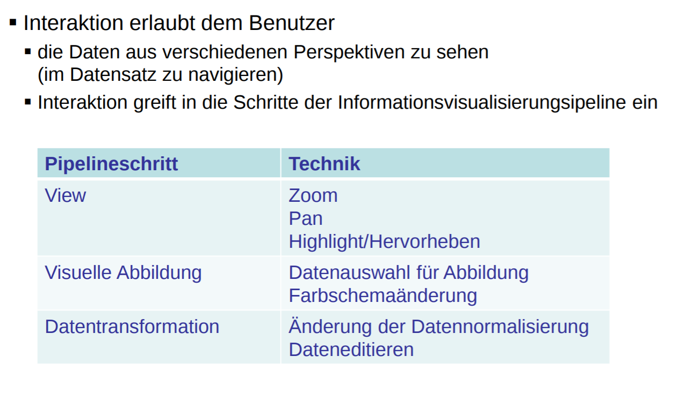

# Informationsvisualisierung
The use of computer-supported,
interactive, visual representations of
abstract data to amplify cognition.

## Informationsdesign

- Gute Visualisierungen sollten
  - Daten nicht verzerrung und Dateninformtationen behalten
  - Vermeiden:
    - Falsche/irreführende Skalierung
    - Verzerrung, Größenverhältnisse, Farben
    - zu volle Darstellung
    - keine Legende

## Techniken
- Datentypen
  - Hierarchien
    - Beziehungen zwischen Objekten top-down
  - Graphen
    - Objekt bestehend aus Knoten
    - Kanten sind Beziehungen zwischen Objekten
    - sehr verbreitet
      - Computernetzwerke
      - WWW
      - Soziale Netzwerke
      - biologische Reaktionen
      - Transportnetze
      - ...
  - Überblick
    - 1D
    - Zeitreihen
    - 2D
    - 3D multidimensional/multivariat
    - Hierarchien/Bäume
    - Netzwerke/Graphen
- 1D
  - Spalte mit Datenwerten
    - über Objekte
    - Verteilungen
    - Zeitreihen
  - typische Visualisierungstechniken
    - Kuchendiagramm
      - Wertunterschiede schlecht sichtbar
    - Balkendiagramm
      - Wertunterschiede gut sichtbar
    - Liniengraphen für Zeitreihen
      - zu viele Linien?
        - Wertefilter
      - zu lange Linien
        - Zeitfilter
- 2D
  - 2 Spalten mit Datenwerten
  - typische Visualisierungstechniken
    - Scatterplot
      - Problem: Overplotting
    - oft Suche nach Korellationen
- 3D, nD
  - n Spalten mit Datenwerten
  - Scatterplot nur limierte Anzahl von Dimensionen
  - Scatterplotmatrix
    - alle paare an Dimensionen als einzelne "Scatterplot Koeffizienten"
    - beliebt in Statistik
  - Problem
    - Viele Dimensionen
    - limietierter Platz für einzelne Scatterplots
    - nur paarweise Abhängigkeiten sichtbar
  - Technik parallele Koordinaten
    - aus Punkt im Scatterplot wird eine Linie in parallelen Koordinaten
    - mehrere Dimensionen nebeneinander abgebildet
    - Abhängigkeit von mehreren Dimensionen leicht sichtbar
    - Auch hier Problem Overplotting
      - Filter!
- Hierarchien
  - Technik Node Link diagram
    - horizontales layout
    - radiales Layout
      - bessere Platznutzung
  - Technik Treemap
    - Kindknoten **im** Elternknoten zeigen
- Grapgen/Netzwerke
  - Graph $G(V, E)$
  - auch hier Node Link Diagramm
  - Layoutproblem
  - Kriterien
    - wenig Kantenüberschneidung
    - möglichst gleich große Kanten
    - wenig Überlappung
    - klar deutliche Strukturen
  - Alternative Adjazenzmatrix

## Interaktion
- View Transformation
  - Navigieren
    - Zooming
    - Panning
    - Reorganisation von Objekten
  - Highlighting
- Visual Mappings
  - Datenauswahl für Abbildungen
  - Farbschemaänderungen
- Datentransformation
  - Daten hinzufügen
  - filtern
  - normalisieren
  - editieren

