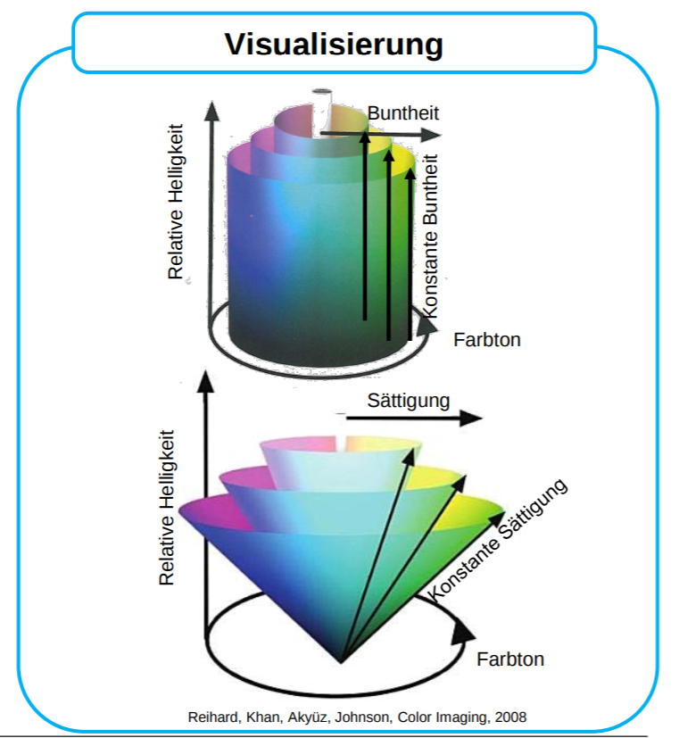
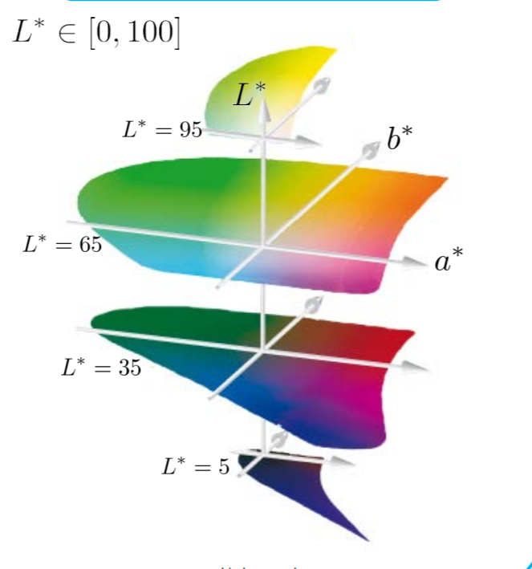
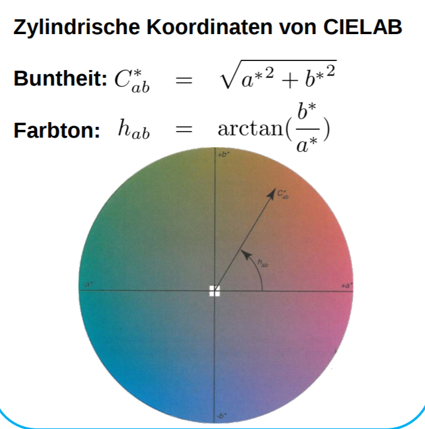
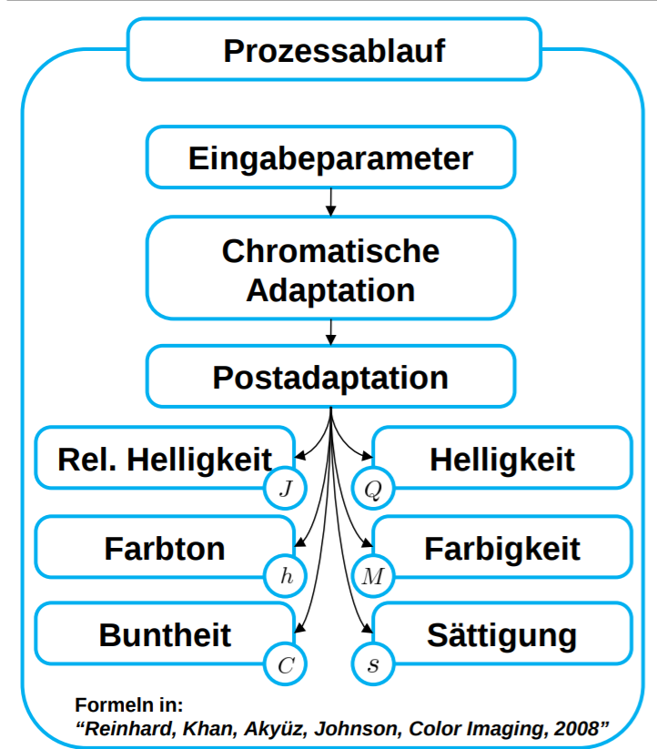
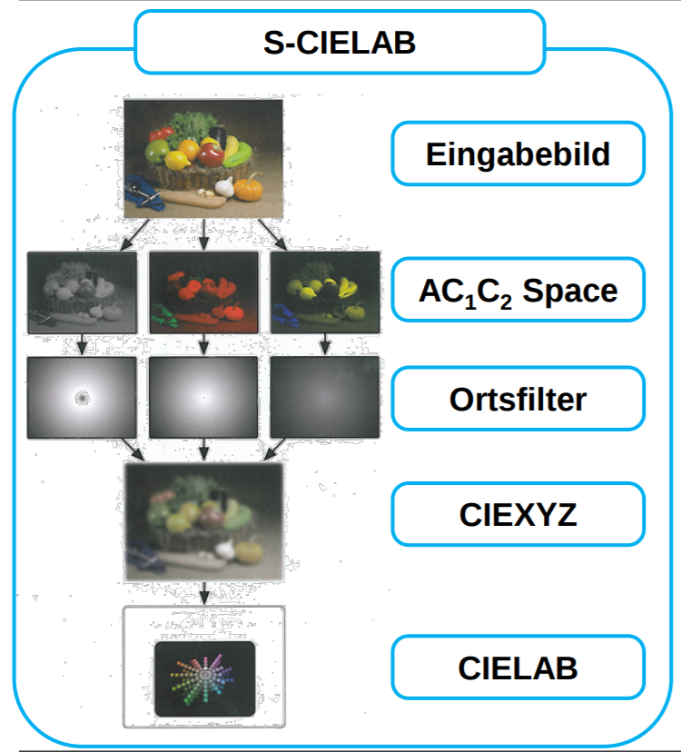
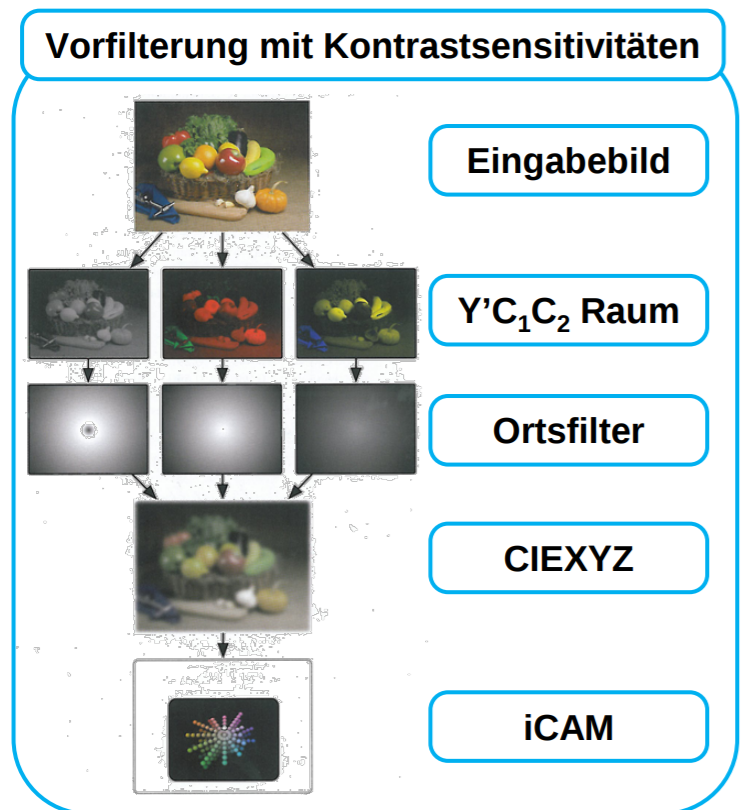

# Farbe

## Farbwahrnehmung
- 5 Dimensional
- Attribute
  - Helligkeit (Brightness)
    - wie viel Licht scheint eine Fläche abzustrahlen?
  - relative Helligkeit (Lightness)
    - Helligkeit einer Fläche relativ zu einer gleich beleuchteten, weiß erscheinenden Fläche
    - $\text{relative Helligkeit} = \frac{\text{Helligkeit}}{\text{Helligkeit(Weiß)}}$
  - Farbton (Hue)
    - wie sehr ehrscheint eine Fläche gleich den Farben Rot, Gelb, Grün und Blau bzw. einer Kombination von 2 dieser Farben
    - achromatische Farben sind wahrgenommene Farben ohne Farbton
  - Farbigkeit (Colorfulness)
    - wie farbig wird eine Fläche empfunden
  - Buntheit (Chroma)
    - Farbigkeit einer Flächer relativ zur Helligkeit einer gleich beleuchteten, weiß erscheinenden Fläche
    - $\text{Buntheit} = \frac{\text{Farbigkeit}}{\text{Helligkeit(Weiß)}}$
- Sättigung kann auch durch Helligkeit und Farbigkeit beschrieben werden
  - $\text{Sättigung} = \frac{\text{Farbigkeit}}{\text{Helligkeit}} = \frac{\text{Buntheit}}{\text{relative Helligkeit}}$
- bezogene Farben
  - werden in Bezug zu anderen Farben wahrgenommen
- unbezogene Farben
  - werden isoliert von anderen Farben wahrgenommen

## Farben berechnen
- Farbreiz $\rightarrow$ Optisches Systen $\rightarrow$ Rezeptoren $\rightarrow$ Antwort/Farbvalenz
- kontinuierliches Modell
- diskretes Modell
  - Annahme nur 3 Fotorezeptoren
  - Spektralwertfunktion
  - $y = Sx$ mit 
    - $y$ 3 dim Vektor (Farbvalenz)
    - $x$ N dim Vektor (Farbreiz)
    - $S$ 3xN dim Systemmatrix
- Objektfarben und Lichtmatrix
  - $l =$ Spektrale Dichteverteilung der Lichtart (n dim vektor)
  - $r =$ Reflextionsspektrum (n dim vektor)
  - $D(\cdot) =$ Operator, der Diagonalmatrix aus Vektor macht
  - Für eine Spektralwertmatrix $A$ wird die reflextionsbasierte Farbvalenz berechnet durch
    - $y = AD(l)r = Lr$
    - mir $L = AD(l)$

## CIEXYZ Farbraum
- Die CIEXYZ Farbkoordinaten (Farbvalenzen) für eine Lichtart $l$ sind definiert als
  - $\begin{pmatrix}
      X \\ Y \\ Z
  \end{pmatrix} = \frac{100}{\bar{y}^Tl}Lr$
  - mit Lichtmatrix $L = (\bar{x}, \bar{y}, \bar{z})^TD(l)$
  - und Reflextionsspektrum $r$
  - Farbvalenzen $(X, Y, Z)$ heißen Normfarbwerte
- CIE xy Chromacity Diagramm (Normfarbtafel)
  - $x = \frac{X}{X+ Y+ Z}$, $y = \frac{Y}{X+ Y+ Z}$, $z = \frac{Z}{X+ Y+ Z}$
  - $x, y$ Koordinaten der monochromatischen Farbreize erzeigen Spektralfarblinie
  - $x,y$ Chromacity Koordinaten einer additiven Mischung von Farbreizen liegen in der konvexen Hülle der Chromacity Koordinaten der Farbreize
  - Häufig benutzte Darstellung für Monitor Farbumfang
- Limitierungen
  - XIEXYZ ist nicht wahrnehmungsgleichabständig
  - modelliert nur die erste Phase des Farbsehens (Auge)
  - erlaubt keinen einfachen Zugriff auf Farbattribute

## Metamerie
- zwei Farbreize $g, f$ mit $g \neq f$ für die gilt $Ag = Af$ heißen Metamere
  - Spektralwertmatrix $A$
  - Bedeutet, dass zwei verschiedene Farbreize gleich wahrgenommen werden
- Beleuchtungsmetamerie
  - Zwei Reflektionsspektren $r_1, r_2$ mit $r_1 \neq r_2$ heißen metamere Reflektionsspektren unter Lichtart $l$, falls $Lr_1 = Lr_2$ mit Lichtmatrix $L= (\bar{x}, \bar{y}, \bar{z})D(l)$
  - Bedeutet zwei verschiedene reflektierende Flächen sehen unter einem Licht $l$ gleich aus, unter einem anderen nicht
- Beobachtermetamerie
  - Zwei Farbreize $g, f$ mit $g \neq f$ erzeigen bei gleichen Betrachtungsbedingungen für eine Person die gleiche, für eine andere Person unterschiedlichen Farbvalenzen
  - $A_1g = A_1f$ aber $A_2g \neq A_2f$ mit Spektralwertmatrix $A_i$ für Person $i$
  - Einflussfaktoren:
    - Dichte der Linse - variation durch:
      - Alter
      - Ernährung
      - Ethnie
      - starkes Rauchen
    - Polymorphismus
      - Maxima spektraler Empfindlichkeiten variieren zwischen Personen (bis zu  9nm)

## Gegenfarbentheorie
- Kodierung der LMS Signale
- $\begin{pmatrix}
    L \\ M \\ S
\end{pmatrix} = (l, m, s)^Tf$
  - mit Cone fundamentals $l, m, s$ (je n-dim. Vektoren)
  - Farbreiz $f$ (n-dim Vektor)
  - Achromatisch $L + M + S$
  - Rot-Grün $L - M + S$
  - Gelb-Blau $L + M - S$
- Stevensche Potenzfunktion
  - Beziehung der Reizstärke mit der Empfindlichkeitsstärke
  - $\psi = k(I - I_0)^n$
    - $\psi =$ Wahrnehmungskorrelat
    - $I =$ Reiz
    - $I_0 =$ gerade noch wahrnehmbarer Reiz
    - $k =$ anpassbare Verstärkung
    - $n =$ anpassbarer Exponent
- CIELAB Farbraum
  - Eingabe 
    - $(X, Y, Z)$ Farbvalenz
    - $(X_n, Y_n, Z_n)$ Farbvalenz des Weißpunktes
  - Transformation
    - $L^* = 116f(Y/Y_n) - 16$
    - $a^* = 500[f(X/X_n) - f(Y/Y_n)]$
    - $b^* = 200[f(Y/Y_n) - f(Z/Z_n)]$
    - $f(\omega) =\begin{cases}
        \omega^{1/3} & \text{ für } \omega > 0.008856 \\
        7.787\omega + 16/116 & \text{ für } \omega \leq 0.008856
    \end{cases}$
  - Ausgabe
    - $L^* =$ relative Helligkeit
    - $a^* =$ Rot-Grün Komponente
    - $b^* =$ Blau-Gelb Komponente
  - 
  - Eigenscahften
    - Gegenfarbraum
    - modelliert nichtlinearitäten des visuellen Systems
    - nahezu wahrnehmungsgleichabständig
- LCh Farbraum
  - 

## Technische Farbräume
- Geräte RGB
  - Zahlenwerte der Geräteantwort oder zur Ansteuretung (meist 8 bit pro Kanal)
- Geräteunabhängige RGB
  - Bezug zum menschlichen visuellen System
    - $\text{CIEXYZ} \xleftrightarrow[]{\text{Transformation}} \text{RGB}$
- YCbCr
  - $Y =$ Luminanz
  - $Cb =$ Blau-Gelb
  - $Cr =$ Rot-Grün
  - z.B. in JPEG
  - kein Bezug zum visuellen System
- HSI (HSV, HSL)
  - $H =$ Hue
  - $S =$ Saturation
  - $I =$ Intensity ($V =$ Value, $L =$ Lightness)
  - Einsatz zur intuitiven Farbauswahl in Grafikprogrammen
  - kein eindeutiger Bezug zum visuellen System
  - HSI Farbattribute stimmen nicht mit tatsächlichen überein (cross contamination)
- CMY / CMYK
  - $C =$ Cyan
  - $M =$ Magenta
  - $Y =$ Yellow
  - $K =$ Black
  - Ansteuerungswerte zur Tintenauswahl bei Druckern (meist 8 bit pro Kanal)
  - Charakterisierung des Druckersystems bedeutet Bestimmung der Transformation von CYMK nach CIEXYZ (Druckergamut)

## Chromatische Adaption
- beschreibt die weitgehend unabhängige Regulierung der Mechanismen beim Farbensehen
- häufig: unabhängige Anpassung der Zapfenempfindlichkeiten an dominante Farbreize der Umgebung
  - $q =$ CIEXYZ Werte für Lichtart $l_1$
  - $p =$ CIEXYZ Werte für Lichtart $l_2$
  - $f =$ Modell der chromatischen Adaption
  - $p = f(q)$ 
- von Kries Modell
  - Annahmen:
    - jeder Zapfen wird individuell adaptiert
    - lineare Transformation

## Farbwahrnehmungsphänomene
- Simultankontrast
  - Hintergrund, auf dem ein Farbreizt präsentiert wird beeinflusst die wahrgenommene Farbe
  - folgen der Gegenfarbentheorie
    - heller Hintergrund induziert dunklere Farbe und umgekehrt
    - rot induziert grün und umgekehrt
    - blau induziert gelb und umgekehrt
- Crispening Effekt
  - wahrgenommer Farbunterschied zweier Farbreize wird durch einen ähnlichen Hintergrund vergrößert
- Stevens Effekt
  - Kontrast steigt mit der Leuchtdichte
    - bei steigender Leuchtdichte sehen dunkle Farben dunkler aus und helle Farben heller
- Hunt Effekt
  - Farbigkeit steigt mit Leuchtdichte

## Farbwahrnehmungsmodelle
- ermöglichen Anpassung der Farbreize für den Farbenabgleich bei unterschiedlichen Betrachtungsbedingungen
- CIECAM02
  - 
  - Eigenschaften
    - ist invertierbar
    - Gegenfarbendarstellung
    - euklidische Metrik im Gegenfarbenraum erlaubt Vorhersage über  empfundenen Farbabstand

## Kontrastsensitivität
- achromatisch
  - größer bei höheren Ortsfrequenzen
  - Bandpaß Charakteristik
- chromatisch
  - Tiefpaß Charakteristik

## Bildwahrnehmungsmodelle
- S-CIELAB
  - 
- iCAM
  - 

