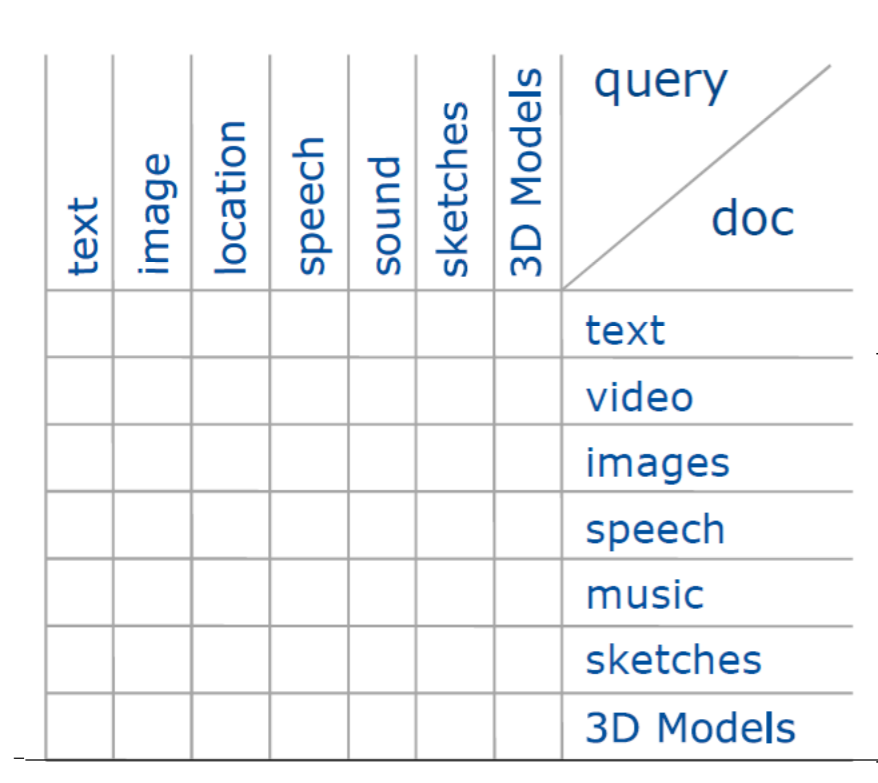

# Multimedia Retrieval

## Nicht Textuelle Dokumente
- riesiger Informationsgehalt in Musik, Bilder, 3D Modelle, Videos etc
- Erschließung klassich über textuelle Annotationen
  - problematisch
  - wenn automatisch erzeugt meist nur syntaktische Information (Dauer, Größe, Pixelzahl, Bitrate)
  - semantische Information höchstens manuell annotiertbar
  - Sprache ist ungenau

## Inhaltsbasierte Suche
- Ansatz
  - **Eigenschaften** ableiten, die Dokumente sinnvoll und semantisch beschreiben "Basis des Dokumentraums"
  - mathematische **Deskriptoren** werden aus dem Inhalt der Dokumente auf diese Eigenschaft berechnet "Linearkombination der Basis"
  - **Distanzmaß** über Deskriptoren erlaubt Vergleich der Dokumente
- Deskriptor wählen
  - abhängig von Problemstellung
  - Semantik der Objekte (Form, Farbe, Funktion)
  - verfügbare Daten (Syntax, Messdaten, Qualität, Rauschen)

## Distanzmaße
- Beschreibung von Dokumenten mittels Featurevektoren
- Ähnlichkeitsbestimmung über deren Distanz
- typische Distanzmaße (euklidisch, City Block) sind Metriken
- **Metriken**
  - Menge $S$ von Features (Muster)
  - Metrik $d : S \times S \rightarrow R$
    - $d(x, y) \geq 0$
    - $d(x, y) = 0 \leftrightarrow x = y$
    - $d(x, y) = d(y, x)$
    - $d(x, y) \leq d(x,z) + d(z, y)$
  - Symmetrie entspricht nicht immer der menschlichen Wahrnehmung
  - Dreiecksungleichung entspricht nicht immer der menschlichen Wahrnehmung
  
## Query Modalitäten

- Text
  - Eingabe:
    - Notenscans
    - Audifiles
  - Zwischenschritt
    - MIDI Extraction
  - Output Zeichenfolge
  - Syntaktisch, nicht semantisch textuell
  - gut für Suchindizes (schnell)
- Automatische Annotation
  - Machine Learning
  - Eingabe: labelled Data
  - Ausgabe: labels für ungesehene Beispiele
  - Anwendung: image tagging, Übersetzungen
  - Bayes Classifier
- Beispiele:
  - Suchen anhand eines Beispielobjekts
  - ähnliche Objekte aus DB holen (Distanz der Feature Vektoren)
  - Bildbeispiel für Bilder
  - 3D MOdellbeispiel für 3D Modelle
  - Musikbeispiel für Musik
  - etc
- Bilder
  - Suche anhand eines Beispielbildes
  - Berechnung der Feature
  - Vektoren aller Bilder der DB
  - Bestimmung der ähnlichsten Bilder mittels k-nearest-neighbours
- Sketch
  - kein Beispielobjket nötig
  - Nutzer hat Vorstellung davon, was er sucht
  - Idee
    - Konvertierung der Objekte in Bilder, die Skizzen ähnlich sind
  - für Bilddaten
    - Canny-Edge Algorithmus
  - für 3D Modelle
    - NPR Non photorealistic Render (Suggestive Contours)
  - zeichnerische Fähigkeiten des Suchenden entscheiden

## Explorative Suche
- im Vergleich zu Querying (Retrieval) keine konkrete Suchanforderung
  - auffinden von interessanten Objekten
  - Clustering für Überblick
  - Details on Demand
- z.B. Messungen bei Klimaforschung
- riesie Datenmenge
- textueller Zusammenhang gegeben
- wie suchen?
  - Funktionale Zusammenhänge der Daten mit FV beschrieben
  - Gruppierung anhand von FV Ähnlichkeit
- 