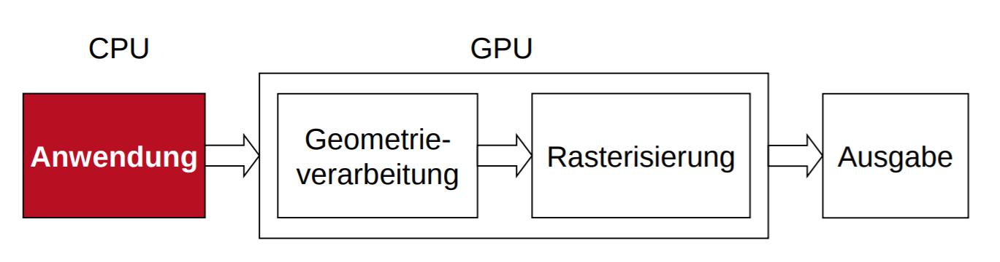

# Grafikpipeline

## Virtual Reality
- Virtual Reality
  - nicht immersive Umgebungen
    - Bildschirm und Zeigerbasiert
    - 3D Anzeige, evtl. haptisches Feedback
  - immersive Umgebungen
    - Eindruck erwecken, tatsächlich in einer Welt aus virtuellen Objekten zu sein
- Augmented Reality
  - nahtlose Intergration zwischen realen und virtuellen Objekten

## Grafikpipeline
 
- Anwendung
  - Eingabe grafischer Daten
  - 3D Modelle generieren
  - Ausgabe räumliche Datenstrukturen
- Geometrieverarbeitung
  - Modell Transformation
    - Parallelprojektion
    - einheitliches Sichtvolumen
  - Beleuchtungssimulation
    - Flat shading
    - Gourad Shading
    - Phong shading
  - Perspektivische Transformation und Clipping
    - Painters Algorithm (von hintern nach vorne zeichnen)
  - Culling
    - Rückseiten entfernen
- Rasterisierung der Primitive
  - PÜrimitive in Pixel zerlegen
    - von Bresehnham (Linien)
  - Scanline
    - Polygone
  - Verdeckungsrechnung
    - z-Buffer algo


## Algorithmus von Bresehnham
- geg: Zwei Punkte (Start und Ende der Linie)
- Ziel: Rasterisierung der Linie
```python
dx = xend - xstart
dy = yend - ystart
x = xstart
y = ystart
SETPIXEL(x, y)
fehler = dx / 2
while x < xend:
    x = x + 1
    fehler = fehler - dy
    if fehler < 0:
        y = y+1
        fehler = fehler + dx
    SETPIXEL(x, y)
```

## z-Buffer Algorithmus
- Tiefenspeicher für jeden Pixel
- über Punkte aller Polygone iterieren, Tiefenspeicher und Farbe im Bild hinterlegen
- \+
  - jede Szene behandelbar
  - Komplexität unabhängig von Tiefe
  - neue Objekte in fertige Szenen einfügbar
  - leicht in Hardware
- \-
  - nur ein Objekt pro Bildpunkt
  - keine Transparenz realisierbar
  - genauigkeit z-Buffer beschränkt

